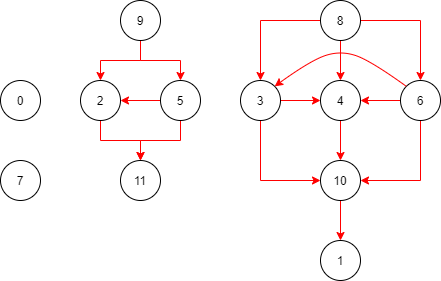

# LeetCode 1203 解题报告

- [LeetCode 1203 项目管理](https://leetcode-cn.com/problems/sort-items-by-groups-respecting-dependencies/)

- [AC BY RUBY](leetcode_1203.rb)

```
这个题目是一个很明显的拓扑排序，由于题目稍微有点麻烦，所以写一下思路。
拓扑排序一般思路是：建有向图 -> 判断是否有环 -> 进行拓扑排序。
上述 3 个步骤中，以第 1 个步骤最为关键，也比较麻烦，所以下面重点讲我的建图思路。
```

## 建有向图

- test case

```
8
2
[-1,-1,1,0,0,1,0,-1]
[[],[6],[5],[6],[3,6],[],[],[]]
```

- 有向图



```
在上述有向图中，0 - 7 表示项目节点，8 - 11 表示 group 节点。
其中，8 和 10 是一个 group 对，9 和 11 是一个 group 对。
group 对需要将所有属于该 group 的项目节点全部包裹进来。

项目 2 / 5 都属于 group 1 ，
而 group 1 对应的节点为 9 (1 + 8 = 9) 和 11 (1 + 8 + 2 = 11)，
所以我们可以添加有向边 [9, 2] / [9, 5] / [2, 11] / [5, 11] 。
并且 5 必须在 2 的前面，所以我们添加有向边 [5, 2] 。

我们再来看下有向边 [10, 1] 是怎么来的。
上述 test case 中规定 6 必须出现在 1 的前面，
但是我们不能直接添加有向边 [6, 1] ，
这样会导致同一 group 的项目彼此不相邻。
我们应该找到项目节点 6 所属的 group 0 ，对应节点为 10 (0 + 8 + 2 = 10) ，
然后找到项目节点 1 所属的 group （由于 1 所属 group 为 -1 ，所以 1 对应的 group 就是其本身）。
然后在两个 group 节点之间添加有向边。
这就是有向边 [10 , 1] 的由来。
```

## 判断有环和拓扑排序

```
判断有环：DFS
拓扑排序：后序遍历的反转
```
