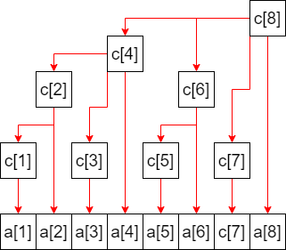

# 树状数组

## lowbit 方法的定义

```
对于任意十进制的数字，我们将其转换为二进制，只取其最低位的 1 能得出一个新的数字。
我们将这个方法定义为 lowbit。
```

十进制 | 二进制 | lowtbit 二进制 | lowbit 十进制
- | - | - | -
1 | 0001 | 0001 | 1
2 | 0010 | 0010 | 2
3 | 0011 | 0001 | 1
4 | 0100 | 0100 | 4
5 | 0101 | 0001 | 1
6 | 0110 | 0010 | 2
7 | 0111 | 0001 | 1
8 | 1000 | 1000 | 8

## 树状数组的特点

数组c | 数组c与数组a的关系 | 数组c包含数组a元素的个数
- | - | -
c[1] | c[1] = a[1..1] | 1
c[2] | c[2] = a[1..2] | 2
c[3] | c[3] = a[3..3] | 1
c[4] | c[4] = a[1..4] | 4
c[5] | c[5] = a[5..5] | 1
c[6] | c[6] = a[5..6] | 2
c[7] | c[7] = a[7..7] | 1
c[8] | c[8] = a[1..8] | 8



```
通过上图我们可以得出如下规律：
规律1：
对于数组c：
parent[i] = i + lowbit(i)

规律2：
sum(0..right) = c[right] + sum(0..(right - lowbit(right)))
```

## lowbit 的求法

```
lowbit(x) = x & (~x + 1) = x & -x
```

```
以 7 为例来说明 lowbit 的求法
7      = 0111
~7     = 1000
~7 + 1 = 1001

7 & ~7       = 0000
7 & (~7 + 1) = 0001

lowbit(x) 也可以理解为能整除 x 的最大 2 的幂次。
```

## 核心代码

```ruby
class BIT
  attr_accessor :tree

  def initialize(length)
    @tree = Array.new(length + 1, 0)
  end

  def insert(index, val: 1)
    while index < @tree.length
      @tree[index] += val
      index += lowbit(index)
    end
  end

  def query(right)
    rtn = 0
    while right > 0
      rtn += @tree[right]
      right -= lowbit(right)
    end
    return rtn
  end

  private

  def lowbit(x)
    x & -x
  end
end
```

## 例题

- [LeetCode 树状数组](https://leetcode-cn.com/tag/binary-indexed-tree/)
- [LeetCode 0493 翻转对](https://leetcode-cn.com/problems/reverse-pairs/)
