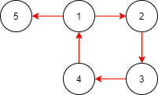
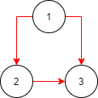
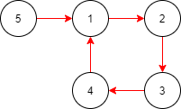

# LeetCode 0685 解题报告

- [LeetCode 0685 冗余连接 II](https://leetcode-cn.com/problems/redundant-connection-ii/)

- [AC BY RUBY](leetcode_0685.rb)

## 分析

```
首先我们定两个个概念：冲突点，冲突边。
冲突点：表示有两个父节点的节点。
冲突边：指向冲突点的边。
那么在给定的有向图中，就存在两种情况。
```

- 不存在冲突点

```
[[1,2], [2,3], [3,4], [4,1], [1,5]]
```



```
上述情况不存在冲突点，这个时候存在多个答案。
我们可以用并查集找出最后一条构成环的边。
答案是：[4, 1] 。
```

- 存在冲突点

```
[[1,2], [1,3], [2,3]]
```



```
上述情况存在冲突点，有两条冲突边 [1, 3] / [2, 3] 。
任意删除一条冲突边都能满足题目要求，但是 [2, 3] 是最后出现的。
所以答案是：[2, 3] 。
```

```
[[1,2], [2,3], [3,4], [4,1], [5, 1]]
```



```
上述情况同样存在冲突点，冲突点为 1 。
但是该情况下的结果是唯一的，我们只能删除 [4, 1] 。

存在冲突点有上述两种情况，不过我们可以通过一种方法来解决。
1. 找到冲突点
2. 找到两条冲突边
3. 尝试删除后出现的冲突边
4. 使用并查集判断是否存在环，
如果不存在环，说明我们第 3 步的操作是正确的，
那么答案就是我们第 3 步中删除的边，也就是最后存现的冲突边；
如果依旧存在环，那答案就是另外一条冲突边，也就是开始出现的冲突边。
```
